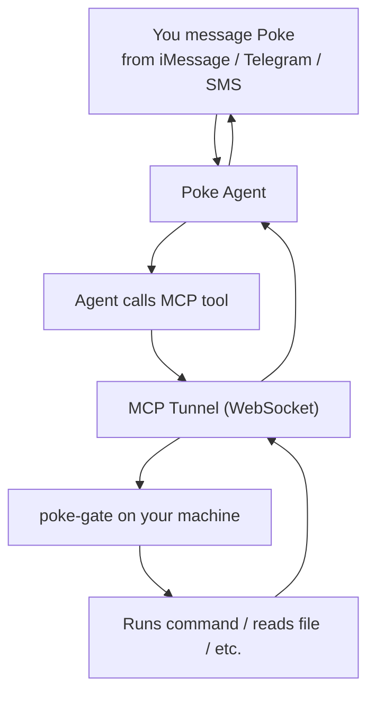

# poke-gate

Expose your machine to your [Poke](https://poke.com) AI assistant via MCP tunnel.

Run `poke-gate` on your machine, then ask Poke from iMessage, Telegram, or SMS to run commands, read files, check system status — anything you'd do in a terminal.

## Quick start

```bash
npx poke-gate
```

On first run, you'll paste your API key from [poke.com/kitchen/api-keys](https://poke.com/kitchen/api-keys).

## How it works



poke-gate runs a local MCP server and tunnels it to Poke's cloud. When you ask Poke something that needs your machine, the agent calls the tools, poke-gate executes them locally, and the result flows back to your chat.

## Tools

| Tool | Description |
|------|-------------|
| `run_command` | Execute any shell command (ls, git, brew, python, curl, etc.) |
| `read_file` | Read a file's contents |
| `write_file` | Write content to a file |
| `list_directory` | List files and directories |
| `system_info` | OS, hostname, architecture, uptime, memory |

## Examples

From iMessage/Telegram, ask Poke:

- "What's running on port 3000?"
- "Show me the last 5 git commits in my project"
- "How much disk space do I have left?"
- "Read my ~/.zshrc and suggest improvements"
- "Create a new file called notes.txt with today's meeting notes"
- "Run the tests in my project"

## Setup

### Option 1: Interactive (recommended)

```bash
npx poke-gate
```

### Option 2: Environment variable

```bash
export POKE_API_KEY=your_key_here
npx poke-gate
```

## Security

**poke-gate grants full shell access to your Poke agent.** This means:

- Any command can be run with your user's permissions
- Files can be read and written anywhere your user has access
- Only your Poke agent (authenticated by your API key) can reach the tunnel

Only run poke-gate on machines and networks you trust. Stop it with `Ctrl-C` when you don't need it.

## Configuration

Config is stored at `~/.config/poke-gate/config.json`:

```json
{
  "apiKey": "your_key_here"
}
```

To reset, delete the file and run `npx poke-gate` again.

## Project structure

```
bin/
  poke-gate.js       Entry point, onboarding
src/
  app.js             Startup: MCP server + tunnel
  mcp-server.js      JSON-RPC MCP handler with OS tools
  tunnel.js          PokeTunnel wrapper
```

## Credits

- [Poke](https://poke.com) by [The Interaction Company of California](https://interaction.co)
- [Poke SDK](https://www.npmjs.com/package/poke)

## License

MIT
