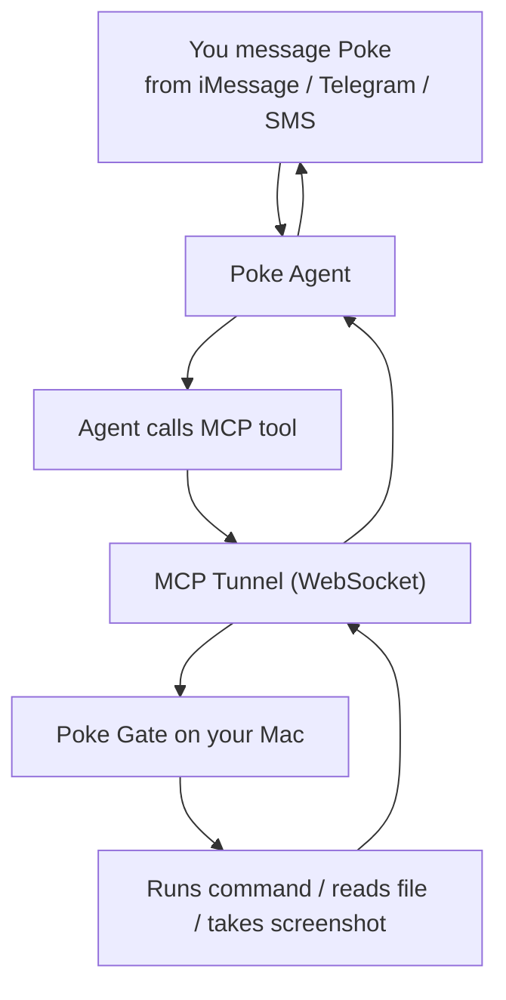

<p align="center">
  
</p>

<h1 align="center">Poke Gate</h1>

<p align="center">
  Let your <a href="https://poke.com">Poke</a> AI assistant access your machine.<br>
  <sub>A community project — not affiliated with Poke or The Interaction Company.</sub>
</p>

<p align="center">
  <a href="https://github.com/f/poke-gate/releases/latest"></a>
  <a href="https://www.npmjs.com/package/poke-gate"></a>
  <a href="https://github.com/f/poke-gate/blob/main/LICENSE"></a>
  
</p>

---

Run Poke Gate on your Mac, then message Poke from iMessage, Telegram, or SMS to run commands, read files, take screenshots, and more — all on your machine.

## Install

**Homebrew** (recommended)

```bash
brew install f/tap/poke-gate
```

**Manual download**

Download the latest **Poke.macOS.Gate.dmg** from [Releases](https://github.com/f/poke-gate/releases), open it, and drag to Applications. Since the app is not notarized, you may need to run:

```bash
xattr -cr /Applications/Poke\ macOS\ Gate.app
```

**CLI** (no macOS app needed)

```bash
npx poke-gate
```

## Setup

1. Get an API key from [poke.com/kitchen/api-keys](https://poke.com/kitchen/api-keys)
2. Open Poke Gate from your menu bar and go to **Settings**
3. Paste your API key and save

The app connects automatically and shows a green dot when ready.

## How it works



Poke Gate runs a local MCP server and tunnels it to Poke's cloud. When you ask Poke something that needs your machine, the agent calls the tools, Poke Gate executes them locally, and the result flows back to your chat.

## Tools

| Tool | What it does |
|------|-------------|
| `run_command` | Execute any shell command (ls, git, brew, python, curl…) |
| `read_file` | Read a text file |
| `read_image` | Read an image file and return it as base64 |
| `write_file` | Write content to a file |
| `list_directory` | List files and directories |
| `system_info` | OS, hostname, architecture, uptime, memory |
| `take_screenshot` | Capture the screen (requires Screen Recording permission) |

## Examples

From iMessage or Telegram, ask Poke:

- "What's running on port 3000?"
- "Show me the last 5 git commits in my project"
- "How much disk space do I have left?"
- "Read my ~/.zshrc and suggest improvements"
- "Take a screenshot of my screen"
- "Create a file called notes.txt on my Desktop"

## macOS App

The menu bar app manages everything:

- **Status** — green dot when connected, yellow when connecting, red on error
- **Personalized** — shows "Connected to your Poke, <name>"
- **Auto-start** — connects on launch if API key is saved
- **Auto-restart** — reconnects automatically if the connection drops
- **Settings** — paste your API key
- **Logs** — view real-time tool calls and connection events
- **Screen Recording** — prompts for permission on first launch

The app runs in the menu bar only (no Dock icon). Quit is the only way to stop it.

### Building from source

Requires macOS 15+ and Xcode 26+.

```bash
git clone https://github.com/f/poke-gate.git
cd poke-gate/clients/Poke\ macOS\ Gate
open Poke\ macOS\ Gate.xcodeproj
```

Hit **Run** in Xcode, or build from the command line:

```bash
./build.sh
```

## CLI usage

If you prefer the command line over the macOS app:

```bash
npx poke-gate
```

On first run, paste your API key when prompted. Add `--verbose` to see tool calls in real time:

```bash
npx poke-gate --verbose
```

Config is stored at `~/.config/poke-gate/config.json`.

## Security

**Poke Gate grants full shell access to your Poke agent.** This means:

- Any command can be run with your user's permissions
- Files can be read and written anywhere your user has access
- Only your Poke agent (authenticated by your API key) can reach the tunnel

Only run Poke Gate on machines and networks you trust.

## Project structure

```
clients/
  Poke macOS Gate/       macOS menu bar app (SwiftUI)
bin/
  poke-gate.js           CLI entry point + onboarding
src/
  app.js                 Startup: MCP server + tunnel
  mcp-server.js          JSON-RPC MCP handler with OS tools
  tunnel.js              PokeTunnel wrapper
```

## Credits

- [Poke](https://poke.com) by [The Interaction Company of California](https://interaction.co)
- [Poke SDK](https://www.npmjs.com/package/poke)

## License

MIT
